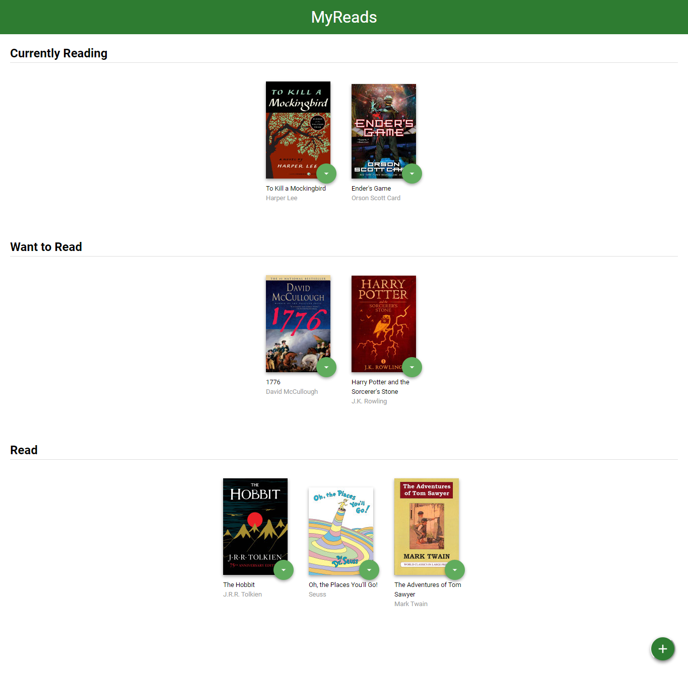

# MyReads Project

* A project made for the Udacity's React Developer Nanodegree program
* a bookshelf app that allows you to select and categorize books you have read, are currently reading, or want to read. 

# How to Load the App

* install all project dependencies with `npm install`
* start the development server with `npm start`

A new browser window should automatically open displaying the app. If it doesn't, navigate to http://localhost:3000/ in your browser

